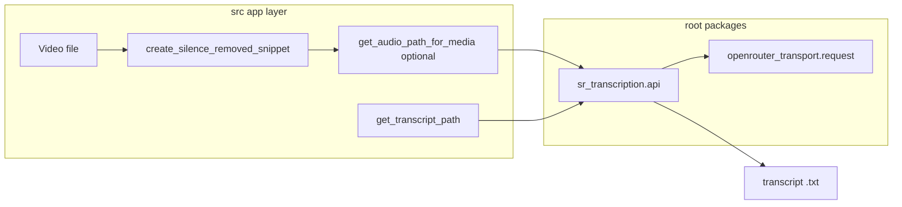

# Plan: Root-level transcription encapsulation

This document is the full implementation plan for extracting a stable **audio file → transcript file** API into dedicated root-level Python packages, plus a minimal shared **OpenRouter transport** layer. It consolidates exploration notes, multi-agent review outcomes, and execution order.

---

## Implementation status

**Done in-tree:** `openrouter_transport/`, `sr_transcription/`, FFmpeg-only `src/llm/audio_for_llm.py`, Hatchling + wheel `packages`, `src/app/pipeline.py` wiring, `README.md` / `AGENTS.md` updates. The former `src/llm/client.py` was **removed** after migration so only **`openrouter_transport/client.py`** implements `request`. The checklist in [In scope](#in-scope-this-stage) is marked complete for traceability.

---

## Overview

- **Goal**: Encapsulate OpenRouter-based transcription so the pipeline (and future scripts) call it like a small function: paths in, transcript written out. FFmpeg/snippet preparation stays in `src/`.
- **Deliverables** (achieved):
  1. Root package **`openrouter_transport/`** — `request`, retries, logging, token limits (successor to the old `src/llm/client.py` implementation).
  2. Root **`sr_transcription/`** — `transcribe_with_openrouter`, `transcribe_and_save`, prompt, format validation; **no FFmpeg**.
  3. **`src/llm/audio_for_llm.py`** — `extract_first_5min_audio`, `get_audio_path_for_media` only (no OpenRouter).
  4. **`pyproject.toml`** — `[build-system]` + Hatchling wheel `packages` including **`src`**, **`sr_transcription`**, **`openrouter_transport`**.
  5. **Docs** — `README.md` architecture paths; `AGENTS.md` changelog per repo rules.
- **Verification**: **Manual only** — run `main.py` / your usual flow, inspect transcripts and console output. No pytest, Ruff roots, mypy, or CI work in this slice.

---

## Benefits when done

| Benefit | Description |
|--------|-------------|
| Stable black box | Transcription = one module with a small API; less scrolling through pipeline + trim + LLM in one file. |
| Safer refactors | Snippet/FFmpeg/path logic can change with lower risk of breaking the OpenRouter contract. |
| Reuse | Any script can call the same function as the pipeline without duplicating HTTP wiring. |
| Single transport | Title and transcription share one `request` implementation (no diverging clients). |
| Install clarity | Explicit packages fix editable/non-editable import behavior for `uv sync` / `pip install`. |
| Pattern for later | Title (or other phases) can get the same capsule treatment without a new architecture. |

---

## Exploration synthesis (boundaries)

Three codebase explorations agreed on:

1. **Stable contract**: The durable API is **`transcribe_and_save`-shaped**: `(api_key, audio_path, output_path, log_dir?, model?)`. It is not “video + temp_dir + basename” and does not embed FFmpeg.
2. **App-layer glue** (stays in `src/`): `create_silence_removed_snippet` (`src/media/trim.py`), `get_snippet_path` / `get_transcript_path` (`src/core/paths.py`), optional video→audio window via `get_audio_path_for_media` (remains next to FFmpeg helpers).
3. **Shared transport**: OpenRouter chat calls live in **`openrouter_transport`** (used by `sr_transcription` and `src/llm/title.py`). The root transcription package does not depend on a `src.llm.client` module (that file was removed after migration).

### Trade-off: `AUDIO_FORMATS` / `AUDIO_EXTENSIONS`

A strict rule “root packages never import `src.*`” conflicts with a **single source of truth** for allowed extensions.

**Preferred approaches**

- **(a)** Narrow import from `src/core/constants.py` into the root transcription package **only** for those literals, or  
- **(b)** New root-level `media_formats.py` that both `src` and the transcription package import.

**Acceptable with discipline**: Duplicate literals in `formats.py` and keep them in sync **by hand** when constants change (no automated parity tests in this slice).

---

## In scope (this stage)

- [x] Create **`openrouter_transport/`**; update `src/llm/title.py`; **`src/llm/client.py` removed** (no shim).
- [x] Root **`sr_transcription/`**: `api.py`, `prompt.py`, `formats.py`, `__init__.py` exports.
- [x] **`src/llm/audio_for_llm.py`** — FFmpeg-only; does not import `sr_transcription` (no cycles).
- [x] **`src/app/pipeline.py`**: `get_audio_path_for_media` from `src.llm.audio_for_llm`; `transcribe_and_save` from `sr_transcription`.
- [x] **`src/llm/prompts.py`** (title-only) and **`src/llm/__init__.py`** re-exports aligned with root packages.
- [x] **`pyproject.toml`**: Hatchling + `packages = ["src", "sr_transcription", "openrouter_transport"]`.
- [x] **`README.md`**: architecture section updated for root packages + `audio_for_llm`.
- [x] **`AGENTS.md`**: session summaries per repo rules.
- [x] **Manual verification** (owner): `uv sync`, `uv run python main.py`, Phase 1 transcript `.txt` output.

---

## Out of scope (defer)

- Standalone transcription **CLI** (`argparse`, `--input-dir`, `--output-dir`, `--file`, …).
- Automated tests (pytest), Ruff/mypy/CI gates, parity tests for duplicated constants.
- Moving **title** generation to a root package.
- New **CLI flags for model ID** (could later pass defaults from `src/core/constants.py`).
- Moving **`get_audio_path_for_media`** to `src/media/` (cleanup only).

---

## Multi-agent review — consensus

### Agreed

- Prepared-audio `Path` → transcript `Path` + OpenRouter is the right capsule; FFmpeg/snippet/temp layout stays in `src/`.
- **`openrouter_transport`** is the **only** low-level OpenRouter implementation; **`src/llm/client.py` deleted** after migration.
- **Import DAG**: `sr_transcription` **↮** `src/llm/audio_for_llm.py` (no mutual imports). **Allowed**: `pipeline` → `sr_transcription` and `pipeline` → `audio_for_llm`.
- **Blast radius (historical)**: Imports moved from `src.llm.client` / `src.llm.transcription` to `openrouter_transport` / `sr_transcription` / `audio_for_llm`; grep after edits was sufficient.

### Debates resolved in this plan

| Topic | Resolution |
|-------|------------|
| Package name `transcription` | Prefer **project-scoped** import name (e.g. `sr_transcription`) **or** keep `transcription/` and **rename** FFmpeg module to e.g. `audio_for_llm.py` in the same change set. |
| Transport name | Use **`openrouter_transport`** (not `openrouter_min`). |
| `AUDIO_FORMATS` | Prefer SSoT via narrow `src.core.constants` import or shared `media_formats`; duplicate only with manual sync. |
| Two clients | **Do not** maintain two full OpenRouter clients. |

### Packaging (Hatchling)

The repo historically had **no `[build-system]`**. Add:

```toml
[build-system]
requires = ["hatchling"]
build-backend = "hatchling.build"

[tool.hatch.build.targets.wheel]
packages = ["src", "sr_transcription", "openrouter_transport"]  # match directories you create
```

**Critical**: Listing **only** `["src"]` does **not** install sibling root packages; `from sr_transcription import ...` fails in install-only environments if omitted.

**Also**: **`src/__init__.py` exists** — shipping the `src` package as a wheel top-level is consistent with current `from src....` imports.

No pytest/Ruff/mypy alignment is required for this slice.

### Verdict

**Approve with changes** — implemented with explicit `packages` including `src`, **`sr_transcription`** + **`audio_for_llm.py`** naming, `AUDIO_FORMATS` via `src.core.constants`, **`openrouter_transport`** as the transport name.

---

## Target directory layout (repository root)

```text
openrouter_transport/
  __init__.py            # export request()
  client.py              # sole OpenRouter transport implementation

sr_transcription/
  __init__.py            # public API
  api.py                 # transcribe_with_openrouter, transcribe_and_save
  prompt.py              # TRANSCRIBE_PROMPT (if co-located)
  formats.py             # validation / re-exports per SSoT choice
```

- **`openrouter_transport`**: Chat `request` only — no product prompts, no FFmpeg.
- **Transcription package**: Builds multimodal user message (text + `input_audio`), validates suffix, writes UTF-8 transcript via `openrouter_transport`. **Never** imports `src/llm/audio_for_llm.py`.

---

## Wiring changes (`src/`)

| File | Change |
|------|--------|
| `src/llm/title.py` | Import `request` from `openrouter_transport` (not `src.llm.client`). |
| `src/llm/prompts.py` | Remove `TRANSCRIBE_PROMPT` if moved to root package; keep title prompts. |
| `src/llm/audio_for_llm.py` | FFmpeg-only: `extract_first_5min_audio`, `get_audio_path_for_media`. No `transcribe_*`, no OpenRouter. |
| `src/llm/__init__.py` | Re-export `TRANSCRIBE_PROMPT` / `transcribe_*` from `sr_transcription`; keep `__all__` consistent. |
| `src/app/pipeline.py` | `transcribe_media`: resolve audio via FFmpeg helper module; call `transcribe_and_save` from root transcription package. |

Phase 1 skip logic uses `is_transcript_done` in `src/core/paths.py` (file exists **and** non-empty after strip); transcript paths are unchanged.

---

## Public API shape (recommended)

```python
def transcribe_audio_to_file(
    *,
    api_key: str,
    audio_path: Path,
    transcript_path: Path,
    log_dir: Path | None = None,
    model: str = "...default...",
) -> Path:
    ...
```

**Path layout**: Keep `get_transcript_path` / temp directory conventions in `src/core/paths.py`; the root package accepts an explicit `transcript_path: Path`.

---

## Running transcription in isolation

| Goal | After this plan |
|------|-----------------|
| Call transcribe from your own code with explicit paths | **Yes** — import root package, call one function. |
| `./pkg/main.py -inputDir … -outputDir … -file …` | **Not in scope** — small follow-up script. |
| Phase 1–like flow from video without Phase 2/3 | Use a **custom script** that chains trim/snippet helpers with `sr_transcription` APIs, or run the full pipeline. |

---

## Data flow (after refactor)



---

## Open decisions (lock before coding)

| Topic | Option A (default) | Option B |
|-------|-------------------|----------|
| Root transcription import name | **`sr_transcription`** | **`transcription/`** + rename FFmpeg module to `audio_for_llm.py` |
| `TRANSCRIBE_PROMPT` | **Co-locate** in root `prompt.py` | Keep in `src/llm/prompts.py`; root imports from `src` |
| `AUDIO_FORMATS` SSoT | **`from src.core.constants import ...`** | Root `media_formats.py` re-export, or duplicate + manual sync |

**Locked for this repo**: **`sr_transcription`**, **`TRANSCRIBE_PROMPT`** in `sr_transcription/prompt.py`, **`AUDIO_FORMATS`** via `from src.core.constants import AUDIO_FORMATS` in `sr_transcription/formats.py`.

---

## Implementation order (completed)

1. Added **`openrouter_transport/`**; switched `src/llm/title.py`; removed **`src/llm/client.py`** after grep showed no remaining imports.
2. Added **`sr_transcription/`** with `formats.py`, `prompt.py`, `api.py`; removed **`src/llm/transcription.py`** in favor of FFmpeg-only **`src/llm/audio_for_llm.py`**.
3. Updated **`src/app/pipeline.py`** imports; manual run on sample media recommended after any future change.
4. Updated **`src/llm/__init__.py`** and **`pyproject.toml`**; `uv sync` / `uv run python main.py` as usual.
5. Updated **`README.md`** architecture paths.
6. **`AGENTS.md`** session notes ongoing per repo rules.
7. *(Optional)* Align **`temp/test_openrouter.py`** comments or imports with the real public API.

---

## Second-round notes (tooling and docs)

- **No** pytest, Ruff, mypy, GitHub Actions, Docker, or devcontainer in repo today — nothing to reconfigure beyond Hatchling.
- **`main.py`** prepends repo root to `sys.path`; still verify behavior after `[build-system]` with `uv run`.
- **Docs**: `README.md` and `AGENTS.md` describe `sr_transcription/`, `openrouter_transport/`, and `src/llm/audio_for_llm.py` (historical mentions of `src/llm/client.py` may remain only as migration context in this plan or changelogs).

---

## Grep checklist (post-change sanity)

```bash
rg 'src\.llm\.client' --glob '*.py'
rg 'transcribe_and_save|transcribe_with_openrouter' --glob '*.py'
rg 'from src\.llm\.transcription|from sr_transcription|from transcription' --glob '*.py'
```

Ensure no circular import between the root transcription package and the FFmpeg helper module.

---

## Document history

- Plan consolidated from Cursor plan `transcription_root_encapsulation_8e736ef3` and iteration notes (agents, manual verification policy, isolation/CLI scope).
