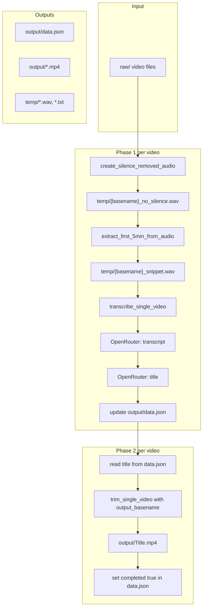

# SilenceRemover flow (after rename-first / data.json refactor)

## High-level

## Step-by-step

| Step | What | Where |
|------|------|--------|
| 1 | Full silence-removed **audio only** (same algorithm as video trim, `-vn`) | `temp/{basename}_no_silence.wav` |
| 2 | First 5 min of that audio | `temp/{basename}_snippet.wav` |
| 3 | Transcribe snippet (two prompts: transcript, then title) | temp `.txt` / `.title.txt` + **data.json** |
| 4 | Full **video+audio** trim with title as filename | `output/{Title}.mp4` |
| 5 | Mark `completed: true` | **output/data.json** |

## data.json shape

- **Path:** `output/data.json`
- **Shape:** `{ "original_video.mp4": { "transcript": "...", "title": "...", "completed": true } }`
- Resume: Phase 1 skipped if `transcript` and `title` present; Phase 2 skipped if `completed` is true.

## Directory layout

- **input_dir** (e.g. `raw/`) – source videos
- **output/** – `data.json` + final trimmed videos (`Title.mp4`)
- **temp/** – `_no_silence.wav`, `_snippet.wav`, `.txt`, `.title.txt` (no “renamed” folder)
